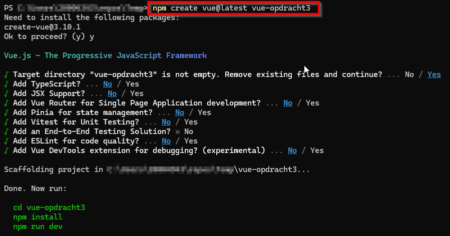

# Vue - Opdracht 3

Zet de JavaScript code van [opdracht 2](https://github.com/PXL-1DVO-WebAdvanced/vue-opdracht2) nu om naar een Vue project! Volg hiervoor de volgende stappen:

- Open je code-editor in de root-folder waar je deze oefening wil plaatsen
- Open een terminal venster in deze folder
- Maak een nieuw Vue project aan met als naam: *vue-opdracht3*

        npm create vue@latest vue-opdracht3

- Selecteer **geen** van de overige packages

- Verwijder in *src/App.vue* alle code en maak een nieuw, leeg script tag, template tag en style tag aan.

        
        <template>

        </template>
        

- Kopieer de div en de ul uit het index.html bestand van opdracht 2 en plak dit tussen de template tag in het App.vue bestand. Voeg ook een leeg list item toe aan de ongeordende lijst.
- Kopieer de inhoud van het gegenereerde css bestand en plaats dit tussen de style tag van het App.vue bestand.
- Bekijk jouw voorlopige resultaat in de browser.

## Functionaliteit
- Je gaat moeten aangeven dat je het inputveld wil **linken** aan een variabele (bv *product*). Dit doe je met het keyword v-model:

        <input type="text" id="product" v-model="product" />

- In de script-tag voeg je dan de variabele toe, die initieel een lege string is:

        

- Vervolgens zorg je ervoor dat wanneer er een product wordt toegevoegd, dit in een lijst terecht komt. Voeg daarom nog een variabele toe die initieel een lege array is: *products: []*
- Bij een klik op de knop moet er iets gebeuren. Daarom voeg je een click event toe aan de knop én een methode die ervoor gaat zorgen dat het product wordt toegevoegd aan de lijst van producten:

        <button v-on:click="addProduct">Voeg dit product toe</button>

- De methode plaats je onder het *data* object in de script tag:

        methods: {
          addProduct() {
            this.products.push(this.product)
          }
        }

- Tenslotte zorg je ervoor dat de producten die in de lijst terecht komen als *list item* worden getoond. Dit doe je door op het lege list item een *for loop* te gebruiken:

        <li v-for="product in products">{{ product }}</li>

- Bekijk het resultaat in de browser.

        npm run dev